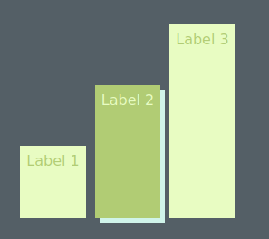

# as-basic-bar-chart

Provides a basic bar chart utility for use in React. See the demo page (https://amsanville.github.io/as-basic-bar-chart/) for examples use.

## Installation
Run:
```shell
npm install --save as-basic-bar-chart\
```
And include:
```javascript
import {Graph} from 'as-basic-bar-chart';
```
in your React App. And finally, to specify the colors include:
```css
:root{
  --color-bar-highlight: #D0F4EA;
  --color-bar-primary: #E8FCC2;
  --color-bar-secondary: #B1CC74;
}
```
The above are the colors from the demo. Feel free to choose any color scheme desired. The primary and secondary colors are the two that alternate on the bars. The highlight is for the mouse over effect.

## Use

The graph class automatically creates graphs using flex boxes based on the numerical data you give it. The data should be an Javascript object with keys for labeling the bars and values for the numerical value of the bars. You can then specify which style (vertical or horizontal) with the horizontal property. For a vertical bar graph, a height should be specified and for a horizontal bar graph a width. Finally a title can be added as well. For example, if:
```javascript
data = {
  'Label 1': 1,
  'Label 2': 2,
  'Label 3': 3,
}
```
Then:
```javascript
<Graph
  title='Vertical Bars'
  height='200px'
  data={data}
/>
```
Produces the first vertical bar graph in the demo. And
```javascript
<Graph
  title='Horizontal Bars'
  width='50%'
  data={data}
  horizontal={true}
/>
```
The second.
